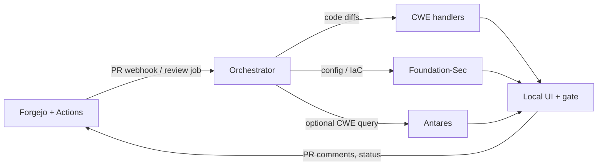

<h1 align="center">Shift-Left</h1>

<p align="center">
  <strong>Local PR review for application code and infrastructure configuration.</strong><br>
Evaluates configuration and code changes against CWEs to surface security defects before merge or deployment. Analyzed artifacts never leave this host. Every finding and decision is audited.
</p>

<p align="center">
  <a href="LICENSE"></a>
  
  
  <a href="https://github.com/briansak/shift-left/stargazers"></a>
</p>

<p align="center">
  <a href="#install">Install</a> ·
  <a href="#documentation">Documentation</a> ·
  <a href="docs/architecture.md">Architecture</a> ·
  <a href="docs/distribution-and-sovereignty.md">Sovereignty</a> ·
  <a href="LICENSE">License</a>
</p>

Pre-merge security review for infrastructure configuration and application code — entirely self-contained for privacy or sovereignty. Diffs, configs, findings, and model inference never leave the host.

Shift-Left reviews pull requests for security defects in network configuration and application code without sending anything to a hosted service. It bundles a local Forgejo instance, routes each PR through structural configuration parsers, and adds advisory output from two locally-hosted security models.

The deterministic layer blocks merges. Model output is advisory providing guidance on a IaC configuration or source code review. Humans are in the loop approving configuration commits or reviewing CWE (Common Weaknesses and Exposures) in submitted code.

> **Important**
> The pipeline evaluates supplied diff and configuration text. It does not connect to live infrastructure or scan hosts. Branch protection on the git host is what turns the gate status into an actual merge control.
>
> Project source is Apache-2.0. Model weights are staged separately under `models/` and are not stored in git — see [docs/licensing.md](docs/licensing.md).

## What it does

**Configuration review — deterministic, blocking.** Changed configuration files are parsed structurally rather than regex-matched, then evaluated against a rule registry. Object groups and network objects resolve to their effective values before evaluation, so `permit ip object-group SRC object-group DST` is judged on what those groups actually contain. 

Supported target types: Cisco ASA, Cisco FMC/FTD via Terraform, IOS-XE, NX-OS, and generic Terraform for AWS, Azure, and GCP. Rules assert CWEs, registry severity drives the gate action, and operator policy can escalate a rule but never silently downgrade one.

**Code review — advisory.** Changed code runs through deterministic handlers. Separately, an operator can launch an Antares investigation: given a repository, a ref, and a CWE, the model explores a read-only snapshot through a sandboxed terminal and returns ranked candidate files.

**Governance.** Approvals and waivers bind to a commit SHA and invalidate when new commits land. Waiver identity is path plus parsed construct plus weakness class, so an unrelated edit that shifts line numbers does not silently revoke an approval. Gate decisions, waiver grants, and investigation launches all write audit events.

## How it works



See [docs/architecture.md](docs/architecture.md) for the component diagram.

A pull request in the bundled Forgejo triggers an Actions job on the self-hosted runner, which posts the diff to the orchestrator. Config files route to the structural parsers, code to the code handlers, and both optionally to Foundation-Sec for advisory annotation. The gate decision, findings, and a commit status land on the head SHA, and the PR comment lists deterministic findings with remediation.

Antares investigations run on a separate on-demand path against a materialized repository snapshot, queued one at a time.

Everything runs on loopback or an internal Docker network with no default gateway. Model weights load from pre-staged local paths; if they are missing, inference fails closed rather than falling back to anything hosted. `./shift-left verify-runtime --real` asserts that outbound HTTP and raw sockets are blocked during a live review.

The Antares implementation is built as a sandboxed, per-investigation Docker container without networking which is destroyed upon completion of an investigation.

## The Short Version

- **CI sends:** the PR diff to the orchestrator on this host
- **Handlers and models review:** changed code and config without leaving the machine
- **You approve:** findings, policy, merge, and deploy in the local UI
- **Nothing analyzed leaves:** customer code, configs, findings, and inference stay local

## Requirements

| | |
|---|---|
| **Primary platform** | Apple Silicon Mac, macOS 14+, 24 GB RAM recommended |
| **Also supported** | Linux x86_64 via a Compose profile for containerized models (documented, not yet tested end to end) |
| **Not supported** | Windows as an operator host |
| **Dependencies** | Docker with Compose (daemon running), Python 3.11+ |
| **Disk** | ~15 GB for images, weights, and reference data |
| **Network** | Install only. Foundation-Sec Q4_K_M downloads without auth. Antares is gated and needs a Hugging Face account with accepted model terms plus `HF_TOKEN`. |

At Q4_K_M with `n_ctx` 4096, Foundation-Sec peaks around 5.4 GB resident and Antares-1B adds roughly 3.7 GB. Both loaded at once alongside sandbox containers is tight on 24 GB, so on-demand model loading is the default.

## Install

```bash
git clone https://github.com/briansak/shift-left.git
cd shift-left
./shift-left up
```

`up` runs idempotent phases: preflight, fetch images and weights, generate `.env` and `config/shift-left.yaml`, start Compose and the host-native model servers, bootstrap Forgejo with an admin account and Actions runner, create a sample repository with a demo pull request, and verify health.

Admin credentials and API tokens print once and are not logged again — store them. Re-run `up` after a failure or interrupt; it resumes where it stopped.

When `up` succeeds, the recommended next step is [docs/quickstart.md](docs/quickstart.md) — about 10–15 minutes to authenticate, walk the sample PR, and get a gate decision on an ASA change you write yourself.

```bash
./shift-left status     # prerequisite health report
./shift-left doctor     # preflight, compose, and config diagnosis
./shift-left down       # stop the stack and model servers
```

Antares triage is optional and off by default:

```bash
./shift-left install-antares
./shift-left model start antares-server
```

To wipe local state:

```bash
./shift-left reset --confirm 'DESTROY SHIFT-LEFT LOCAL STATE'
```

## Using it

The UI is at `http://127.0.0.1:8080/ui/`, authenticated with a token from `./shift-left token mint`. Forgejo is at `http://127.0.0.1:3000`.

| Page | Path |
|---|---|
| System health and configuration | `/ui/system` |
| Managed targets | `/ui/targets` |
| PR review | `/ui/pr/{owner}/{repo}/{n}` |
| Investigations | `/ui/investigations` |
| CWE reference catalog | `/ui/cwe` |
| Audit log | `/ui/audit` |

**The review loop.** A developer opens a pull request against a repository carrying the Shift-Left workflow. The runner posts the diff, findings and a gate decision land on the head SHA, and a reviewer who is not the commit author records approval in the UI. If a finding needs to be accepted rather than fixed, an approver waives it with a written reason — visible, audited, and expiring on the next commit.

**Adding repositories.** `./shift-left new-repo <name>` scaffolds a repository with the workflow and mints the Actions secret it needs. `./shift-left import-config <path>` previews which configuration globs would match an existing tree.

**Code investigation.** The launch form takes a repository, a ref, and a CWE — entered directly or resolved from a CVE against the local reference cache. Batch mode queues the language-filtered CWE Top 25 as independent investigations, each with its own budget. The batch view shows per-CWE evidence tiers from a deterministic repository profiler and flags candidates from CWEs with no repository evidence.

Deterministic gate latency is about 0.6 seconds. The advisory model path adds roughly 3 seconds. An Antares investigation takes 20–90 seconds.

## Offline install

On a connected machine, `./shift-left bundle-build` produces an offline bundle. On an air-gapped target, `./shift-left bundle-install` followed by `./shift-left up` runs it. See [docs/air-gapped-install.md](docs/air-gapped-install.md).

## Operator CLI

Entry point is `./shift-left` (equivalently `./scripts/shift-left`).

| Command | Description |
|---|---|
| `up [--force] [--no-browser]` | Full bootstrap |
| `down` | Stop Compose and supervised model servers |
| `status` / `doctor` | Health report and setup diagnosis |
| `reset --confirm '…'` | Wipe local data under `.shift-left/` and `data/` |
| `install` | Pull images, stage Q4 weights, sync reference seed |
| `install-antares` | Download Antares weights (`HF_TOKEN` required) |
| `model start\|stop\|restart <service>` | Control host-native model servers |
| `new-repo` / `import-config` | Scaffold a repository or preview config globs |
| `token mint\|list\|revoke` | API token lifecycle |
| `bundle-build` / `bundle-install` | Offline install bundle |
| `verify-runtime [--real]` | Live review with runtime egress blocked |

Override Compose detection with `SHIFT_LEFT_COMPOSE_COMMAND`.

The HTTP API exposes `GET /health`, `POST /api/v1/review`, plus findings, policy, approvals, gate, investigations, and audit endpoints. A bearer token is required except for `/health` and `/self-check` — see [docs/auth-tokens.md](docs/auth-tokens.md) and [docs/api-guide.md](docs/api-guide.md). Browse the generated spec at [docs/index.html](docs/index.html) (GitHub Pages) or [docs/openapi.yaml](docs/openapi.yaml). GitHub Pages must be enabled once in the repository settings (Settings → Pages → Source: GitHub Actions). Try it out is disabled on the hosted page; the API only listens at `http://127.0.0.1:8080` on the operator host.

## Configuration

Copy `config/shift-left.example.yaml`, or let `./shift-left up` generate `config/shift-left.yaml`. The schema version must match `CURRENT_SCHEMA_VERSION` in `services/orchestrator/shift_left/config.py`.

Customer repositories default to the bundled Forgejo on the same host. `git.backend` also supports GitHub and GitLab once sovereignty for those hosts is explicitly acknowledged — see [docs/git-backends.md](docs/git-backends.md).

## Documentation

- [Quickstart](docs/quickstart.md) — first gate decision after `./shift-left up`
- [Architecture](docs/architecture.md)
- [What we measured](docs/validation-summary.md) — labeled-corpus gate results and why models stay advisory
- [Supported platforms](docs/supported-platforms.md)
- [Configuration reference](docs/configuration-reference.md)
- [API guide](docs/api-guide.md) · [OpenAPI explorer](docs/index.html) · [OpenAPI 3.1 YAML](docs/openapi.yaml)
- [Gate enforcement](docs/gate-enforcement.md)
- [Distribution and runtime sovereignty](docs/distribution-and-sovereignty.md)
- [Air-gapped install](docs/air-gapped-install.md)
- [Secret redaction](docs/secret-redaction.md)
- [Antares triage](docs/antares-triage.md)
- [Git backends](docs/git-backends.md)
- [API tokens](docs/auth-tokens.md)
- [Model licensing and checksums](docs/licensing.md)
- [Troubleshooting](docs/troubleshooting.md)
- [Writing rules](docs/writing-rules.md)
- [Contributing](docs/CONTRIBUTING.md)
- [Validation reports](validation/)

## License

Source in this repository is Apache-2.0 — see [LICENSE](LICENSE) and [THIRD_PARTY_NOTICES.md](THIRD_PARTY_NOTICES.md). Model weights are staged under `models/`, are not stored in git, and remain subject to their upstream Apache-2.0 model cards. See [docs/licensing.md](docs/licensing.md).
