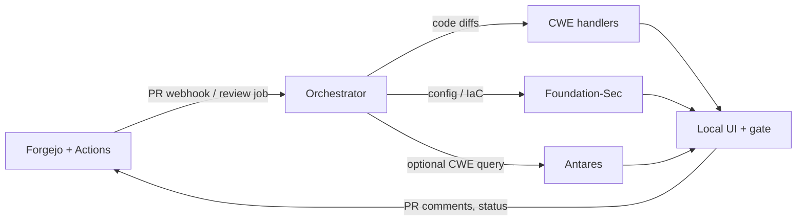

# Architecture

This document describes how Shift-Left is built and how its components connect. Read it before installing or contributing if you need the system map.

Shift-Left is a local pull-request review pipeline. It evaluates supplied diffs and configuration text against CWE-oriented rules and locally hosted models. Analyzed artifacts — customer code, configs, findings, and inference — stay on the operator host. The pipeline does not scan or connect to live infrastructure.

Project source is hosted on GitHub. Customer repositories default to a bundled Forgejo instance on the same host.



A pull request in the git host triggers a self-hosted Actions job, which posts the change to the orchestrator. Config files go to structural parsers (and optionally Foundation-Sec for advisory annotation). Code files go to deterministic code handlers. The gate decision and deterministic findings land on the head SHA. Antares investigations are a separate, operator-initiated path against a materialized repository snapshot.

## Runtime topology

Docker Compose project `shift-left` (`docker-compose.yml`) runs the git host, CI runner, and orchestrator. Model servers run either on the host (Apple Silicon default) or as Compose services (Linux profiles).

```
                    host loopback
  ┌─────────────────────────────────────────────────────────────┐
  │  UI / API  :8080     Forgejo  :3000     SSH  :2222          │
  │  Models    :8090 Antares    :8091 Foundation-Sec (macOS)    │
  └───────────────┬──────────────────────────┬──────────────────┘
                  │ edge                     │
         ┌────────▼────────┐        ┌────────▼─────────┐
         │  forgejo        │        │  orchestrator    │
         │  forgejo-runner │        │                  │
         └────────┬────────┘        └────────┬─────────┘
                  │ sovereign_internal       │
         ┌────────▼────────┐   host.docker.internal :8090/:8091
         │  postgres       │        (macOS host-native models)
         │  antares-server │        or in-compose on Linux
         │  foundation-sec │
         └─────────────────┘
```

| Network | Role |
|---------|------|
| `sovereign_internal` | Internal Compose network (`internal: true`). No default gateway to the public internet. |
| `edge` | Host-facing ports: Forgejo UI/SSH, orchestrator HTTP. |

On macOS, Antares and Foundation-Sec bind `127.0.0.1` and the orchestrator reaches them via `host.docker.internal:host-gateway` on ports 8090 and 8091 only. On Linux, those servers join `sovereign_internal` under Compose profiles `linux-gpu` / `linux-cpu`.

Runtime HTTP from the orchestrator uses an allowlist (`shift_left/http/local_client.py`). Model weights load from pre-staged local paths; missing weights fail closed with no hosted fallback. `./shift-left verify-runtime --real` exercises a live review with outbound HTTP and raw sockets blocked.

Install and update (`./shift-left up`, `install`, `sync-reference-data`, offline bundles) are operator-initiated and may use the network. That is separate from runtime. See [distribution-and-sovereignty.md](distribution-and-sovereignty.md).

## Components

### Operator CLI (`cli/shift_left_cli`)

Entry point `./shift-left` (equivalently `./scripts/shift-left`). Bootstraps the stack (`up` / `down`), stages weights, mints API tokens, scaffolds repos, and runs health/doctor/verify. It is not on the review path.

### Bundled git host

| Service | Image / build | Role |
|---------|---------------|------|
| `postgres` | `postgres:16-alpine` | Forgejo metadata (not the findings store). |
| `forgejo` | Forgejo 11 rootless | Customer repos, PRs, Actions, branch protection. Bound on the host (`:3000`, SSH `:2222`). |
| `forgejo-runner` | `docker/forgejo-runner` | Self-hosted Actions runner. Review jobs call `POST /api/v1/review` on the orchestrator. |
| `ci-job-image` | `docker/ci-job` | Job container image (profile `ci-image-only`). |

Git access is abstracted by `GitBackend` (`services/orchestrator/shift_left/git/protocol.py`). The default is `bundled-forgejo`. Optional `github` and `gitlab` backends are available when configured; those send review I/O to the remote git API. See [git-backends.md](git-backends.md).

### Orchestrator (`services/orchestrator`)

FastAPI process (`shift_left.main`). Owns the review workflow, policy, gate, UI, investigations queue, and audit. Listens on `:8080`. Source lives under `services/orchestrator/shift_left/`.

| Package | Responsibility |
|---------|----------------|
| `review/` | PR review: fetch diff, route files, run handlers, persist findings, evaluate policy. |
| `routing/` | Split changed paths into code vs config vs skipped/unclaimed. |
| `handlers/config/` | Structural parsers and rule registry for ASA, FMC/FTD Terraform, IOS-XE, NX-OS, generic Terraform. |
| `handlers/` | Code CWE handlers and unclaimed-file findings (CWE-657). |
| `policy/` | Policy engine, registry-gate mapping, waivers, construct keys. |
| `gate/` | Deployment-gate evaluation and commit-status publish (`shift-left/gate`). |
| `approval/` | SHA-bound approvals and finding waivers. |
| `changes/` | Server-side change workflow state for the UI. |
| `foundation_sec/` | Client for Foundation-Sec `/v1/analyze`. |
| `antares/` | Client for Antares triage plus sandbox audit ingest. |
| `investigations/` | Queue, snapshot checkout, batch launch, dispositions. |
| `triage/` | Antares triage service (operator-initiated). |
| `targets/` | Managed target registry (per-repo config type and path globs). |
| `git/` | Backend factory and Forgejo/GitHub/GitLab adapters. |
| `auth/` | Bearer tokens (`slt_…`) and capability checks. |
| `ui/` | Server-rendered HTML under `/ui/*`. |
| `models/` | Shared schema (`Finding`, `Policy`, `AuditEvent`, …) and SQLite stores. |
| `http/` | Local-only HTTP client. |
| `sovereignty/` | Startup egress probe and remote-inference rejection. |
| `system/` | Health, Compose/model-server lifecycle, settings. |
| `reference/` | Local CVE/CWE cache used at review time. |
| `profiler/` | Deterministic repo evidence surfaces for investigation batches. |
| `cwe/` | CWE catalog helpers and localization candidate lists. |
| `deployment/` | Deployment-plan records bound to a commit. |

HTTP API (bearer token except `/health` and `/self-check`): `POST /api/v1/review`, findings, policy, approvals, waivers, gate, investigations, audit. There is no Forgejo webhook listener; Actions jobs call `POST /api/v1/review`. See [auth-tokens.md](auth-tokens.md) and the [OpenAPI explorer](index.html).

The UI is presentation only — Jinja templates and static assets, bound to loopback by default (`http://127.0.0.1:8080/ui/`). Pages include system health, managed targets, PR review, investigations, CWE reference, policy, and audit.

Human review is required in orchestrator code (`human_review_required=false` is rejected). PR comments list deterministic findings and state that they require reviewer judgment.

### Foundation-Sec (`services/foundation-sec-server`)

Local GGUF inference (llama.cpp) for config/IaC diffs. Default port `:8091`.

- `POST /v1/analyze` — handler rules plus optional model enrichment. Enrichment is advisory; it is not a policy input.
- `POST /v1/unload` — drop GGUF context when load strategy is on-demand.

On the PR path the orchestrator still runs structural handlers itself for the merge gate. Foundation-Sec annotation appears in the Shift-Left UI, not in the PR comment body.

### Antares (`services/antares-server`)

Local transformer inference for CWE localization. Default port `:8090`. Optional; installed with `./shift-left install-antares`.

- `POST /v1/triage/run` — agent loop used by investigations.
- `POST /v1/completions` — OpenAI-compatible completions.
- `POST /v1/unload` — unload weights.

Each investigation materializes a hardened snapshot of a local checkout (symlinks discarded, path escapes rejected) and runs the agent in a dedicated Docker container with `network=none`. The container is destroyed when the run finishes. Output is ranked candidate files (`LocalizationResult`); it is never a `Finding` and never feeds the merge gate. See [antares-triage.md](antares-triage.md).

### Shared library (`services/shift-left-shared`)

`shift_left_shared` — model-server bind/startup, offline weight loading, path exclusions, and related runtime helpers used by both inference services and the orchestrator.

## Review pipeline

```
PR opened / updated
        │
        ▼
Forgejo Actions job  ──POST /api/v1/review──►  Orchestrator
        │                                         │
        │                    GitBackend.get_pull_diff
        │                                         ▼
        │                              parse unified / config diff
        │                                         ▼
        │                              route_changes (code | config | skip)
        │                          ┌──────────────┼──────────────┐
        │                          ▼              ▼              ▼
        │                   code handlers   config parsers   unclaimed
        │                   (CWE rules)     (registry)       (CWE-657)
        │                          │              │
        │                          │     optional Foundation-Sec
        │                          └──────────────┤
        │                                         ▼
        │                              policy engine (handler CWEs only)
        │                                         ▼
        │                         persist findings + policy decision
        │                                         ▼
        │                    gate status on head SHA + PR comment
        └─────────────────────────────────────────────────────────
```

**Routing.** `routing.code_globs` and `routing.config_globs` classify paths. When a path is in both, the config parser is authoritative. Paths outside both (and not excluded) produce CWE-657. Parse failures inside a claimed config scope produce CWE-754 (for example ASA-007, IOS-001, HCL-001).

**Config parsers.** Structural, not regex-only. Object groups and network objects resolve to effective values before a rule fires. Target types:

| Target type | Typical paths | Parser |
|-------------|---------------|--------|
| `cisco_secure_firewall` | `*.rules`, `*.conf` | ASA |
| `cisco_ios_xe` | `*.cfg`, `*.conf`, `*.txt` | IOS-XE |
| `cisco_nx_os` | `*.cfg`, `*.conf`, `*.txt` | NX-OS |
| `cisco_ftd` | `*.tf`, `*.hcl` | FMC Terraform |
| `generic_terraform` | `*.tf`, `*.hcl`, `*.tfvars` | HCL / cloud providers |

Rules live in `handlers/config/rules/registry.py`. Registry severity drives gate action; operator policy may escalate a rule but cannot silently downgrade one. Details: [gate-enforcement.md](gate-enforcement.md).

**Policy and gate.** The policy engine consumes `handler_asserted_cwe` only. Approvals and waivers bind to a commit SHA and invalidate when a new commit lands. Waiver identity is path + parsed construct + weakness class. The gate publishes commit status `shift-left/gate`; branch protection on the git host is what turns that status into merge control.

**Fail closed.** Handler or inference failures on the review path do not produce an allow decision. Analysis records a failure class and stage (for example handler match vs generation) and the UI surfaces them on the PR page.

## Investigations

Operator-initiated, queued one at a time. Launch takes a repository, ref, and CWE (or a CVE resolved against the local reference cache). Batch mode queues language-filtered CWE Top 25 (or a profiled/custom set) as independent runs.

The orchestrator checks out or updates `{antares_triage.repos_checkout_dir}/{owner}/{repo}`, asks Antares to snapshot and explore, stores `LocalizationResult` plus the exploration trace, and records audit events for launch, completion, cancel, and candidate disposition.

## Data stores

| Store | Engine | Purpose |
|-------|--------|---------|
| Forgejo metadata | PostgreSQL (`postgres` service) | Git hosting, Actions, PR metadata. |
| Findings | SQLite (`findings_store.sqlite_path`) | Normalized review findings per PR. |
| Audit | SQLite | Review, gate, waiver, investigation events. |
| Auth tokens | SQLite | API token records. |
| Reference cache | `data/reference/` | CVE/CWE seed used at review; never fetched during a review. |
| Model weights | `models/` | Pre-staged GGUF / transformer checkpoints; not in git. |
| Repo checkouts | `data/repos/` | Local trees for Antares snapshots. |

Postgres is not the findings database.

## Shared schema

Defined in `services/orchestrator/shift_left/models/schema.py`:

| Type | Role |
|------|------|
| `Finding` | Normalized handler or model output, status lifecycle, `handler_asserted_cwe`, `trace`. |
| `Policy` / `PullRequestPolicyDecision` | Evaluation result used by the gate. |
| `LocalizationResult` | Antares triage output; advisory only; forbidden in policy rules. |
| `AuditEvent` | Append-only action log. |
| `ApprovalRecord` / `FindingWaiverRecord` | SHA-bound human decisions. |
| `DeploymentGateResult` | Allow/block plus block reasons for commit status. |
| `ChangeState` | Server-computed workflow state for a PR. |

Model-server HTTP contracts: [model-server-contract.md](model-server-contract.md).

## Related

- [supported-platforms.md](supported-platforms.md)
- [gate-enforcement.md](gate-enforcement.md)
- [configuration-reference.md](configuration-reference.md)
- [api-guide.md](api-guide.md)
- [distribution-and-sovereignty.md](distribution-and-sovereignty.md)

